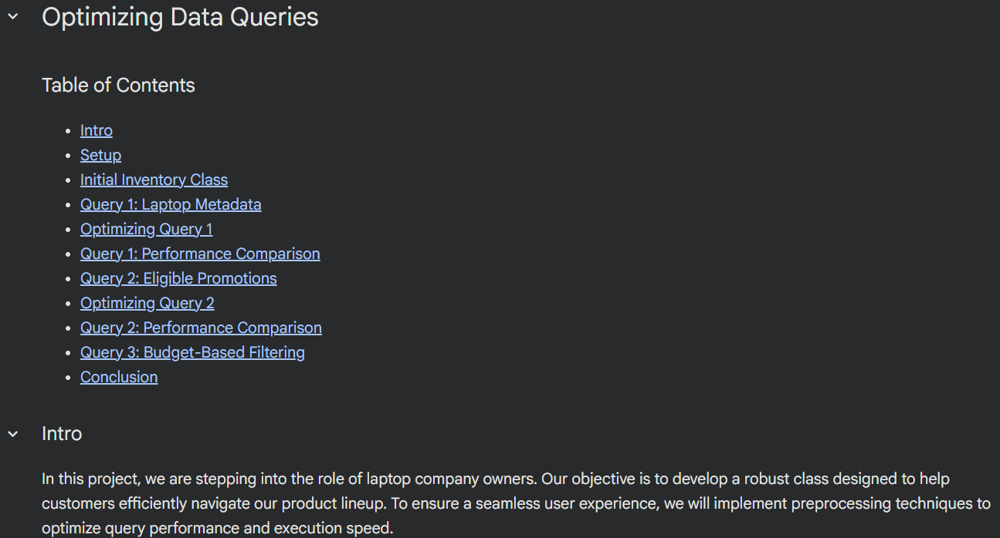

# Optimizing Data Queries

In this project, we are stepping into the role of laptop company owners. Our objective is to develop a robust class designed to help customers efficiently navigate our product lineup. To ensure a seamless user experience, we will implement preprocessing techniques to optimize query performance and execution speed.

Our system will be capable of handling three core queries:

1.  **ID Lookup:** Given a specific laptop ID, the system retrieves and displays the corresponding product data.
2.  **Price Pair Matching:** Given a specific dollar amount, the system determines if any two laptops have a combined price equal to that total.
3.  **Budget Filtering:** Given a maximum budget, the system identifies how many laptops are priced at or below that limit.

View this project live on Google Colab [here](https://colab.research.google.com/drive/1JzNHwu01fHmk04LQj9idRqxYWChDlJT-?usp=sharing)
